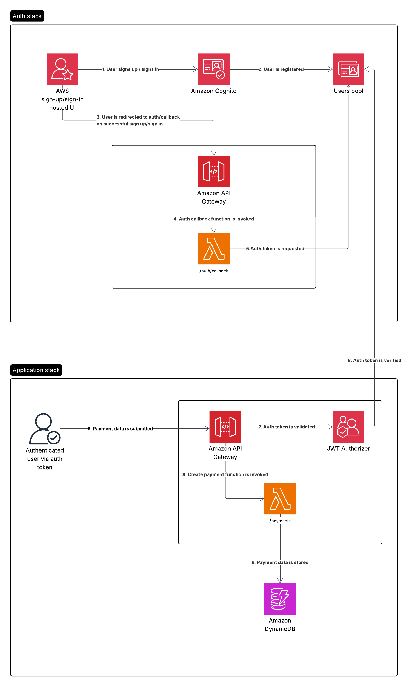

# Authenticated payments tracker system

## Exercise description

Our company is planning to help customers build better credit score by leveraging their existing commitments. This new
product will enable our customers to be able to submit their monthly recurring payments from their existing bank
account. These recurring payments can be a Netflix Subscription, a Gym Membership or even their Rent. By submitting this
information to our systems, our organization will be able to create a report on a monthly basis and can add these
successful commitments to their customer’s credit file.

A single submission sent to the system contains the following information:

1. Unique payment identifier (UUID v4)
2. User ID (UUID v4)
3. Payment timestamp
4. Payment description
5. Currency
6. Amount

You are assigned to design and implement a new API for supporting this new product.
Functional and non-functional requirements for this new API are described below.
Please provide your solution covering the following points:

1. High level system design
   a. System architecture using AWS services (required: DynamoDB as database and Lambda for compute)
   b. Security & Access Management of API and data
   c. High level plan of how to operate this new API to serve 100K monthly active Users
   d. API Contract (e.g. OpenAPI)
2. Implementation
   a. Cloud infrastructure definition (IaC)
   b. Endpoint for submitting recurring payment data

## Setup and deploy project

Install localstack if you want to test things locally (on MacOS, use `brew install localstack/tap/localstack-cli`):
Install cdk and cdklocal dependencies: `npm install -g aws-cdk aws-cdk-local `

To deploy the stacks:

```bash
cdk bootstrap
cdk deploy --all
```

To destroy the stacks:

```bash
cdk destroy Stacks: ApplicationStack && cdk destroy Stacks: AuthStack
```

Once the stack is deployed on AWS,

- Grab the link to create a user (sign up link) from the CDK's execution output, create a user with emal and password,
  verify the account and copy the auth token
- USe the payments API URL form the CDK's execution output to submit payment records

With the auth token and the payments API endpoint, you can execute the acceptance tests or requests via curl, Postman,
etc. to submit payment records.


## Execute automated tests

Before executing integration tests, run

```bash
LOCALSTACK_DEFAULT_REGION=us-east-1 localstack start -d
AWS_REGION=us-east-1 cdklocal bootstrap
USE_LOCALSTACK=true AWS_REGION=us-east-1 cdklocal deploy Stacks: ApplicationStack

npm run test:integration
```

Executing acceptance test:

```bash
PAYMENTS_API_ENDPOINT=https://... BEARER_TOKEN=... npm run test:acceptance
```

## High level architecture diagram



Currently the auth token is returned in the HTML rendered by the auth/callback endpoint, this is just for testing
purposes and in real scenario this would be returned as part of an HTTP only cookie.

Additional security measures could be implemented such as rate limiting the auth/callback endpoint, and other mechanisms
to prevent brute force attacks.

For example during sign up / sign in.

```typescript
/* /signup or /signin endpoints */
const stateStore = new ExternalStateStore();
const state = crypto.randomUUID();
stateStore.set(state, Date.now().toString()); // date can be used to expire the state after a certain period of time
redirectTo("https://${COGNITO_DOMAIN}/oauth2/authorize/...&state=${state}")
```

```typescript
/* /auth/callback endpoint */
const stateStore = new ExternalStateStore();

const { code, state } = request.query;

if (!code || !state) {
  return response.status(400);
}

if (!stateStore.has(state)) {
  return response.status(403);
}

stateStore.delete(state); // single-use
```

As the whole architecture is based on serverless components, it can scale in terms of infrastructure and costs to handle
the load of 100K monthly active users.

## API spec

Can be found in the `docs/api/specification.yml` file.

## Out of scope

The query to retrieve the payments of a given user and generate a monthly report is not implemented as it has been
considered as out of scope for this exercise.

The functionality to test authentication end to end has been considered as out of scope for this exercise as it requires
a paid subscription to localstack. 

Other improvements such as enabling sourcemaps, dynamoDB backups and other features to get it closer to production ready
environment have been considered as out of scope for this exercise.
